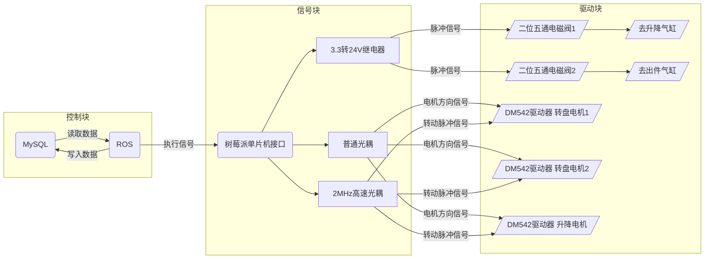

# warehouse

```mermaid
graph LR
	subgraph 控制块
		sql(MySQL)--读取数据-->ros
		ros--写入数据-->sql
	end
	subgraph 信号块
	ros(ROS)--执行信号-->raspberry(树莓派单片机接口)
		raspberry-->high_optocoupler[2MHz高速光耦]
		raspberry-->optocoupler[普通光耦]
		raspberry-->relay[3.3转24V继电器]
	end
	subgraph 驱动块
		relay--脉冲信号-->valve1[/二位五通电磁阀1/] & valve2[/二位五通电磁阀2/]
		valve1 --> cylinder1[/去升降气缸/]
		valve2 --> cylinder2[/去出件气缸/]
		optocoupler--电机方向信号-->motor1[/DM542驱动器 转盘电机1/] & motor2[/DM542驱动器 转盘电机2/] & motor3[/DM542驱动器 升降电机/]
		high_optocoupler--转动脉冲信号-->motor1[/DM542驱动器 转盘电机1/] & motor2[/DM542驱动器 转盘电机2/] & motor3[/DM542驱动器 升降电机/]
	end
```

